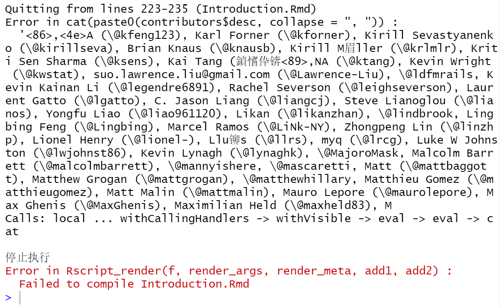
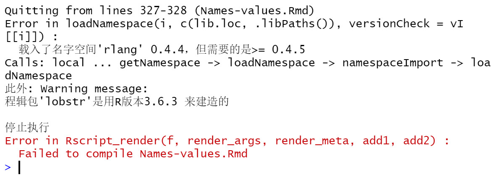
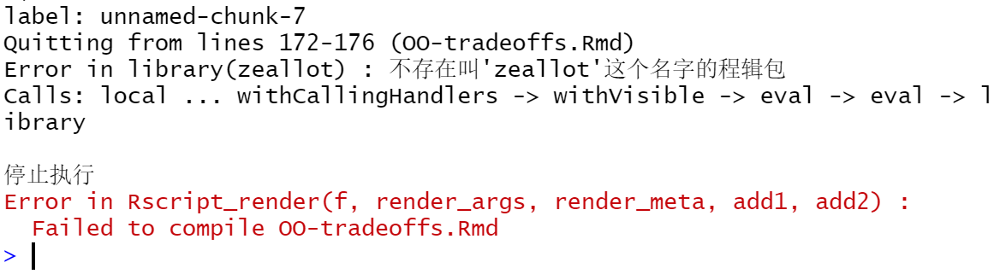
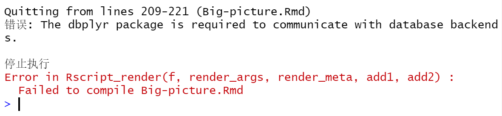
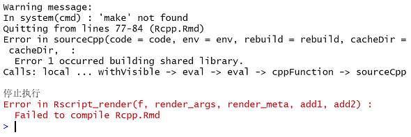
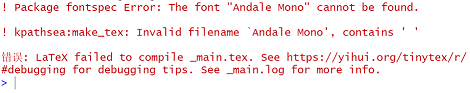

----
title: "Problems and Solutions to Build the Book Advanced R Programming using RStudio"
author: "Shiying Xiao"
output:
  pdf_document: default
  html_document: default
---

To be clear, my computer system is `Windows10`. Use Git to clone the source of Hadley Wickham's **Advanced R Programming**. Set working directory temporarily using `setwd("C:/Users/-carol/dsia02/adv-r")`. Install R Package dependencies using `devtools::install_github("hadley/sloop")` and `devtools::install_github("hadley/emo")`. Finanlly, use  `bookdown::render_book("index.Rmd", output_format = "bookdown::pdf_book")` to compile the book.

During the building process, I've met several problems, the followings are the errors I've met and how I solved them. Note: due to previous learning needs, [*TinyTex*],[*MiKTex*],[*Pandoc*] and some packages have been installed on my computer, some packages that must be installed during the compilation process may not be recorded.

## Unable to load devtools package

Execute the following command in Git
`$ git config --global http.sslBackend "openssl"`
`$ git config --global http.sslCAInfo [path to .pem file]`

## Quitting from lines 223-235 (Introduciton.Rmd)

```{r}

```

Adding `encoding = "UTF-8"` in line 224 can fix it. The line 224 is displayed as `contributors <- read.csv("contributors.csv", stringsAsFactors = FALSE,encoding = "UTF-8")`

## Quitting from lines 327-328 (Names-values.Rmd)

```{r}

```

I first updated `rlang` by the update function in RStudio, but it failed. So I manually removed `rlang` based on the path `D:/R/R-3.6.2/library/rlang`, and then reinstalled `rlang` using `install.packages("rlang")`.

## Quitting from lines 172-176 (OO-tradeoffs.Rmd)

```{r}

```

`install.packages("zeallot")`

## Quitting from lines 209-221 (Big-picture.Rmd)

```{r}

```

`install.packages("dbplyr")`

## Quitting from lines 77-84 (Rcpp.Rmd)

```{r}

```

I added `C:\Rtools\bin\` to the path of the environment variable of the computer system, but the error still occurred, so I reinstalled `Rtools` and successfully solved this problem.

## Font

```{r}

```

I downloaded the font `Andale Mono` from the network and copied it to `C:\Windows\Fonts`.

After 4 hours of intermittent compilation, the book was finally built.